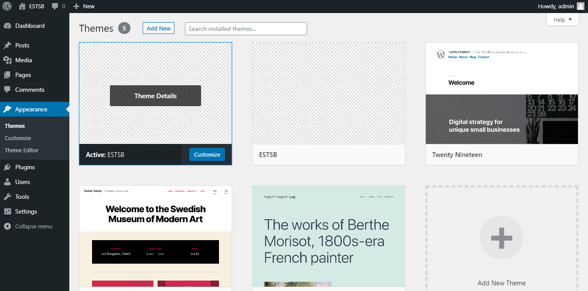

# site-estsb-wordpress
Site web de ESTSB en wordpress


## Télécharger WordPress 

Tout d’abord, [téléchargez le dossier WordPress](https://fr.wordpress.org/download/) sur votre ordinateur et ouvrez le dossier compressé pour accéder à l’ensemble des fichiers PHP.


## Télécharger le theme

```bash
    git clone https://github.com/zakaria-lagouader/site-estsb-wordpress.git
```

le copier dans le dossier : /wp-content/themes

## Selectionn
aller à **theme** > **appearance** <br>
le sélectionner comme theme par defaut :



## Voila le theme

